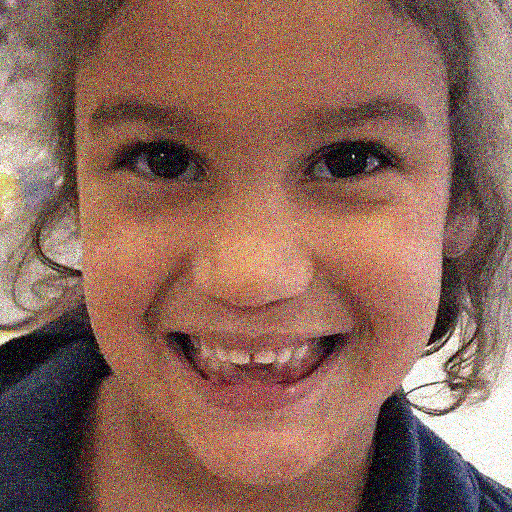

<!--A curated list of resources for Deep Face Restoration-->
<!-- PROJECT LOGO -->
<p align="center">
  <h3 align="center">Deep Face Restoartion: Denoise,
Super-Resolution, Deblur and Artifact Removal </h3>
  <p align="center">A comprehensive list of resources for Deep Face Restoartion
    <br />
    <br />
    <br />
    <a href="https://github.com/TaoWangzj/Awesome-Face-Restoration/issues/new">Suggest new item</a>
    <br />
    <a href="https://github.com/TaoWangzj/Awesome-Face-Restoration/issues/new">Report Bug</a>
  </p>
</p>


This repository provides a summary of deep learning-based face restoration algorithms. 
Our classification is based on the review paper "A Survey of Deep Face Restoration: Denoise, Super-Resolution, Deblur, Artifact Removal".

|  |  |  | | |
| :----------------------------------------------------------: | :----------------------------------------------------------: | :----------------------------------------------------------: |:----------------------------------------------------------: |:----------------------------------------------------------: |
|           Blind Face Restoration                          |                      Face Super-Resolution                                | Face Deblurring</font>        |Face Denoising    | Face Artifact Removal

## Survey paper
T. Wang, k. Zhang, X. Chen, W. Luo, J. Deng, T. Lu, X. Cao, W. Liu, H. Li, and S. Zafeiriou “A Survey of Deep Face Restoration: Denoise, Super-Resolution, Deblur, Artifact Removal,” arXiv preprint arXiv:2211.02831, 2022. [[pdf](https://arxiv.org/pdf/2211.02831.pdf)]

```
@article{wang2022survey
  title={A Survey of Deep Face Restoration: Denoise, Super-Resolution, Deblur, Artifact Removal},
  author={Wang, Tao, and Zhang, kaihao, and Chen, Xuanxi and Luo, Wenhan and Deng, Jiankang and Lu, Tong and Cao, Xiaochun and Liu, Wei and Li, Hongdong and Zafeiriou, Stefanos},
  journal={arXiv preprint arXiv:2211.02831},
  year={2022}
}

```
See our paper for more details.
If you have any suggestions, feel free to contact me (e-mail: taowangzj@gmail.com). Thanks.

## Table of contents
<!-- - [Survey paper](#survey-paper)
- [Table of contents](#table-of-contents) -->
- [Related Surveys](#related-surveys)
- [Deep Blind Face Restoration](#deep-blind-face-restoration)
- [Deep Face Super-Resolution](#deep-face-super-resolution)
- [Deep Face Deblurring](#deep-face-deblurring)
- [Deep Face Denoising](#deep-face-denoising)
- [Deep Face Artifact Removal](#deep-face-artifact-removal)
- [Benchmark Datasets](#benchmark-datasets)
## Related Surveys
<!-- |year|Pub|Title|Link|
|:----:|:----:|:----:|:----:|
|2020|TPAMI|Single image deraining: From model-based to data-driven and beyond|\[[paper]()\]|
|2020|NN|Deep learning on image denoising: An overview|\[[paper]()\]|
|2020|TPAMI|Deep learning for image superresolution: A survey|\[[paper]()\]|
|2022|IJCV|Deep image deblurring: A survey|\[[paper]()\]|
|2022|Neuro-<br>computing|A survey of deep learning approaches to image restoration|\[[paper]()\]| -->
|year|Pub|Title|Link|
|:----:|:----:|:----:|:----:|
|2012|CCBR|A Survey of Face Hallucination|\[[paper](https://link.springer.com/chapter/10.1007/978-3-642-35136-5_11)\]|
|2014|IJCV|A Comprehensive Survey to Face Hallucination|\[[paper](https://d1wqtxts1xzle7.cloudfront.net/48096013/A_Comprehensive_Survey_to_Face_Hallucina20160816-23072-psaoh5-with-cover-page-v2.pdf?Expires=1667883349&Signature=CO8qTT-ea~qrcn7G6PXKe7lgy8ZephuTzx-9sZx5hJkkZOZipg8ufrsKifsOBKiYoHoNurU9fIcAcht3uTbvCa9N-YknSAcrbGl8sGeVTMFlp1gGRPW3nMiisHB-HT5us6bsrVyDIpCumf0hIOEX5DT5tN~uKmPTkcCpkcXqaI6EKZuR1bTMMgz8Ome6CVoE0C0oW8spIKa2T10kREyCwZi2PPFyi4A7v29h5cj8CNHH96NH2lOS-fJn4WzCKULDBFNXCPrDbuDzbWt3eDfknTASLyWls53BDFpC86KMwK2h2wZx91BtaOCYjCJulJCIIO1JakYCgVgwj9EbnxcPfQ__&Key-Pair-Id=APKAJLOHF5GGSLRBV4ZA)\]|
|2018|PR|Super-resolution for biometrics: A comprehensive survey|\[[paper](https://www.sciencedirect.com/science/article/abs/pii/S0031320318300049)\]|
|2018|CICT|Face Hallucination Techniques: A Survey|\[[paper](https://ieeexplore.ieee.org/abstract/document/8722416)\]|
|2019|IET-<br>Image-<br>Processing|Survey on GAN-based Face Hallucination with its Model Development|\[[paper](https://ietresearch.onlinelibrary.wiley.com/doi/full/10.1049/iet-ipr.2018.6545)\]|
|2020|CSUR|Deep Learning-based Face Superresolution: A Survey|\[[paper](https://dl.acm.org/doi/full/10.1145/3485132)\]|
|2022|Arxiv|A Survey of Deep Face Restoration: Denoise, Super-Resolution, Deblur, Artifact Removal|\[[paper](https://arxiv.org/pdf/2211.02831.pdf)\]|
## Deep Blind Face Restoration  
|Year<div style="width:20px">|Pub<div style="width:60px">|Title<div style="width:600px">|Links<div style="width:100px">|Arch<div style="width:45px">|
|:---:|:----:|:----:|:----:|:----:|
|2018|ECCV|Learning Warped Guidance for Blind Face Restoration|\[[paper](https://openaccess.thecvf.com/content_ECCV_2018/papers/Xiaoming_Li_Learning_Warped_Guidance_ECCV_2018_paper.pdf)\]\[[code](https://github.com/csxmli2016/GFRNet)\]|CNN|
|2018|CVPR|FSRNet: End-to-End Learning Face Super-Resolution with Facial Priors|\[[paper](https://openaccess.thecvf.com/content_cvpr_2018/papers/Chen_FSRNet_End-to-End_Learning_CVPR_2018_paper.pdf)\]\[[code](https://github.com/tyshiwo/FSRNet)\]|CNN|
|2019|IJCV|Identity-preserving Face Recovery from Stylized Portraits|\[[paper](https://Arxiv.org/pdf/1904.04241.pdf)\]\[code\]|GAN|
|2020|ECCV|Blind Face Restoration via Deep Multi-scale Component Dictionaries|\[[paper](https://Arxiv.org/pdf/2008.00418)\]\[[code](https://github.com/csxmli2016/DFDNet)\]|CNN|
|2020|CVPR|Enhanced Blind Face Restoration with Multi-Exemplar Images <br>and Adaptive Spatial Feature Fusion|\[[paper](https://openaccess.thecvf.com/content_CVPR_2020/papers/Li_Enhanced_Blind_Face_Restoration_With_Multi-Exemplar_Images_and_Adaptive_Spatial_CVPR_2020_paper.pdf)\]\[[code](https://github.com/csxmli2016/ASFFNet)\]|CNN|
|2020|MM|HiFaceGAN: Face Renovation via Collaborative Suppression and Replenishment|\[[paper](https://Arxiv.org/pdf/2005.05005.pdf)\]\[[code](https://github.com/Lotayou/Face-Renovation)\]|GAN|
|2020|CVPR|Image Processing Using Multi-Code GAN Prior|\[[paper](https://openaccess.thecvf.com/content_CVPR_2020/papers/Gu_Image_Processing_Using_Multi-Code_GAN_Prior_CVPR_2020_paper.pdf)\]\[[code](https://github.com/genforce/mganprior)\]|GAN|
|2021|TPAMI|Face Restoration via Plug-and-Play 3D Facial Priors|\[[paper](https://www.zora.uzh.ch/id/eprint/214478/1/ZORA214478.pdf)\]\[code\]|CNN|
|2021|CVPR|Progressive Semantic-Aware Style Transformation for Blind Face Restoration|\[[paper](https://openaccess.thecvf.com/content/CVPR2021/papers/Chen_Progressive_Semantic-Aware_Style_Transformation_for_Blind_Face_Restoration_CVPR_2021_paper.pdf)\]\[[code](https://github.com/chaofengc/PSFRGAN)\]|GAN|
|2021|CVPR|Towards Real-World Blind Face Restoration with Generative Facial Prior|\[[paper](https://openaccess.thecvf.com/content/CVPR2021/papers/Wang_Towards_Real-World_Blind_Face_Restoration_With_Generative_Facial_Prior_CVPR_2021_paper.pdf)\]\[[code](https://xinntao.github.io/projects/gfpgan)\]|GAN|
|2021|CVPR|GAN Prior Embedded Network for Blind Face Restoration in the Wild|\[[paper](https://openaccess.thecvf.com/content/CVPR2021/papers/Yang_GAN_Prior_Embedded_Network_for_Blind_Face_Restoration_in_the_CVPR_2021_paper.pdf)\]\[[code](https://github.com/yangxy/GPEN)\]|GAN|
|2022|Arxiv|Multi-prior learning via neural architecture search for blind face restoration|\[[paper](https://Arxiv.org/pdf/2206.13962.pdf)\]\[[code](https://github.com/YYJ1anG/MFPSNet)\]|CNN|
|2022|CVPR|Blind Face Restoration via Integrating Face Shape and Generative Priors|\[[paper](https://openaccess.thecvf.com/content/CVPR2022/papers/Zhu_Blind_Face_Restoration_via_Integrating_Face_Shape_and_Generative_Priors_CVPR_2022_paper.pdf)\]~~\[[code](https://github.com/TencentYoutuResearch/BFR-SGPN)\]~~|GAN|
|2022|CVPR|RestoreFormer: High-Quality Blind Face Restoration <br> from Undegraded Key-Value Pairs|\[[paper](https://Arxiv.org/pdf/2201.06374.pdf)\]\[[code](https://github.com/wzhouxiff/RestoreFormer)\]|ViT|
|2022|NeurIPS|Towards Robust Blind Face Restoration with Codebook Lookup Transformer|\[[paper](https://Arxiv.org/pdf/2206.11253.pdf)\]\[[code](https://github.com/TencentARC/VQFR)\]|ViT|
|2022|AAAI|Panini-Net: GAN Prior Based Degradation-Aware Feature Interpolation for Face Restoration|\[[paper](https://arxiv.org/pdf/2203.08444.pdf)\]\[[code](https://github.com/jianzhangcs/panini)\]|GAN|
|2022|Arxiv|FaceFormer: Scale-aware Blind Face Restoration with Transformers|\[[paper](https://Arxiv.org/pdf/2207.09790.pdf)\]\[[code](https://shangchenzhou.com/projects/CodeFormer)\]|ViT|
|2022|Arxiv|Blind Face Restoration: Benchmark Datasets and a Baseline Model|\[[paper](https://Arxiv.org/pdf/2206.03697.pdf)\]\[[code](https://github.com/bitzpy/blind-face-restoration-benchmark-datasets-and-a-baseline-model)\]|ViT|

## Deep Face Super-Resolution  
|Year<div style="width:20px">|Pub<div style="width:60px">|Title<div style="width:600px">|Links<div style="width:100px">|Arch<div style="width:45px">|
|:---:|:----:|:----:|:----:|:----:|
|2015|AAAI|Learning Face Hallucination in the Wild|\[[paper](https://www.aaai.org/ocs/index.php/AAAI/AAAI15/paper/viewPDFInterstitial/9752/9824)\]\[code\]|CNN|
|2016|ECCV|Deep Cascaded Bi-Network for Face Hallucination|\[[paper](http://home.ie.cuhk.edu.hk/~ccloy/files/eccv_2016_hallucination.pdf)\]\[code\]|CNN|
|2016|ECCV|Ultra-Resolving Face Images by Discriminative Generative Networks|\[[paper](https://link.springer.com/content/pdf/10.1007/978-3-319-46454-1_20.pdf)\]\[[code](https://github.com/jiaming-wang/URDGN)\]|GAN|
|2017|CVPR|Attention-Aware Face Hallucination via Deep Reinforcement Learning|\[[paper](https://openaccess.thecvf.com/content_cvpr_2017/papers/Cao_Attention-Aware_Face_Hallucination_CVPR_2017_paper.pdf)\]\[code\]|CNN|
|2017|CVPR|Hallucinating Very Low-Resolution Unaligned and Noisy Face Images by <br>Transformative Discriminative Autoencoders|\[[paper](https://openaccess.thecvf.com/content_cvpr_2017/papers/Yu_Hallucinating_Very_Low-Resolution_CVPR_2017_paper.pdf)\]\[code\]|CNN|
|2017|ICCV|Learning to Super-Resolve Blurry Face and Text Images|\[[paper](https://openaccess.thecvf.com/content_ICCV_2017/papers/Xu_Learning_to_Super-Resolve_ICCV_2017_paper.pdf)\]\[[code](https://sites.google.com/view/xiangyuxu/deblursr_iccv17)\]|GAN|
|2017|AAAI|Face Hallucination with Tiny Unaligned Images <br> by Transformative Discriminative Neural Networks|\[[paper](https://ojs.aaai.org/index.php/AAAI/article/view/11206)\]\[code\]|GAN|
|2018|ECCV|Face Super-resolution Guided by Facial Component Heatmaps|\[[paper](https://openaccess.thecvf.com/content_ECCV_2018/papers/Xin_Yu_Face_Super-resolution_Guided_ECCV_2018_paper.pdf)\]\[code\]|CNN|
|2018|CVPR|Super-FAN: Integrated facial landmark localization and <br> super-resolution of real-world low resolution faces in arbitrary poses with gans|\[[paper](https://openaccess.thecvf.com/content_cvpr_2018/papers/Bulat_Super-FAN_Integrated_Facial_CVPR_2018_paper.pdf)\]\[code\]|GAN|
|2018|ECCV|To learn image super-resolution,<br> use a GAN to learn how to do image degradation first|\[[paper](https://openaccess.thecvf.com/content_ECCV_2018/papers/Adrian_Bulat_To_learn_image_ECCV_2018_paper.pdf)\]\[[code](https://github.com/jingyang2017/Face-and-Image-super-resolution)\]|GAN|
|2019|CVPRW|Exemplar Guided Face Image Super-Resolution without Facial Landmarks|\[[paper](https://openaccess.thecvf.com/content_CVPRW_2019/papers/NTIRE/Dogan_Exemplar_Guided_Face_Image_Super-Resolution_Without_Facial_Landmarks_CVPRW_2019_paper.pdf)\]\[[code](https://github.com/berkdogan2/GWAInet)\]|CNN|
|2019|BMVC|Progressive Face Super-Resolution via Attention to Facial Landmark|\[[paper](https://Arxiv.org/pdf/1908.08239.pdf)\]\[[code](https://github.com/DeokyunKim/Progressive-Face-Super-Resolution)\]|CNN|
|2020|WACV|Component Attention Guided Face Super-Resolution Network: CAGFace|\[[paper](https://openaccess.thecvf.com/content_WACV_2020/papers/Kalarot_Component_Attention_Guided_Face_Super-Resolution_Network_CAGFace_WACV_2020_paper.pdf)\]\[[code](https://github.com/SeungyounShin/CAGFace)\]|CNN|
|2020|TNNLS|Dual-Path Deep Fusion Network for Face Image Hallucination|\[[paper](https://ieeexplore.ieee.org/abstract/document/9229100)\]\[code\]|CNN|
|2019|NEUCOM|On potentials of regularized Wasserstein generative adversarial networks for<br> realistic hallucination of tiny faces|\[[paper](https://www.sciencedirect.com/science/article/abs/pii/S0925231219310203)\]\[code\]|GAN|
|2020|CVPR|PULSE: Self-Supervised Photo Upsampling via <br>Latent Space Exploration of Generative Models|\[[paper](https://openaccess.thecvf.com/content_CVPR_2020/papers/Menon_PULSE_Self-Supervised_Photo_Upsampling_via_Latent_Space_Exploration_of_Generative_CVPR_2020_paper.pdf)\]\[[code](https://github.com/adamian98/pulse)\]|GAN|
|2021|TBBIS|E-ComSupResNet: Enhanced Face Super-Resolution Through Compact Network|\[[paper](https://ieeexplore.ieee.org/abstract/document/9353687)\]\[code\]|CNN|
|2021|MM|Face Hallucination via Split-Attention in Split-Attention Network|\[[paper](https://Arxiv.org/pdf/2010.11575.pdf)\]\[[code](https://github.com/mdswyz/SISN-Face-Hallucination)\]|CNN|
|2021|ICIP|Progressive Face Super-Resolution with Non-Parametric Facial Prior Enhancement|\[[paper](https://ieeexplore.ieee.org/abstract/document/9506610)\]\[[code](https://github.com/BenjaminJonghyun/NPFNet)\]|GAN|
|2022|CVPR|GCFSR: a Generative and Controllable Face Super Resolution Method <br> Without Facial and GAN Priors|\[[paper](https://openaccess.thecvf.com/content/CVPR2022/papers/He_GCFSR_A_Generative_and_Controllable_Face_Super_Resolution_Method_Without_CVPR_2022_paper.pdf)\]\[[code](https://github.com/hejingwenhejingwen/GCFSR)\]|GAN|
|2022|ECCV|VQFR: Blind Face Restoration with Vector-Quantized Dictionary and <br> Parallel Decoder|\[[paper](https://Arxiv.org/pdf/2205.06803.pdf)\]\[[code](https://github.com/TencentARC/VQFR)\]|CNN|
|2022|TPAMI|EDFace-Celeb-1 M: Benchmarking Face Hallucination with a Million-scale Dataset|\[[paper](https://arxiv.org/pdf/2110.05031.pdf)\]\[[code](https://github.com/HDCVLab/EDFace-Celeb-1M)\]|CNN|
  
## Deep Face Deblurring   

|Year<div style="width:20px">|Pub<div style="width:60px">|Title<div style="width:600px">|Links<div style="width:100px">|Arch<div style="width:45px">|
|:---:|:----:|:----:|:----:|:----:|
|2017|Arxiv|DeepDeblur: Fast one-step blurry face images restoration|\[[paper](https://Arxiv.org/pdf/1711.09515.pdf)\]\[code\]|CNN|
|2018|CVPR|Deep Semantic Face Deblurring|\[[paper](https://openaccess.thecvf.com/content_cvpr_2018/papers/Shen_Deep_Semantic_Face_CVPR_2018_paper.pdf)\]\[[code](https://github.com/joanshen0508/Deep-Semantic-Face-Deblurring)\]|CNN|
|2020|IJCV|Exploiting Semantics for Face Image Deblurring|\[[paper](https://Arxiv.org/pdf/2001.06822.pdf)\]\[[code](https://github.com/BenjaminJonghyun/NPFNet)\]|CNN|
|2020|TIP|Deblurring Face Images using Uncertainty Guided Multi-Stream Semantic Networks|\[[paper](https://Arxiv.org/pdf/1907.13106.pdf)\]\[[code](https://github.com/rajeevyasarla/UMSN-Face-Deblurring)\]|CNN|
|2020|MM|HiFaceGAN: Face Renovation via Collaborative Suppression and Replenishment|\[[paper](https://Arxiv.org/pdf/2005.05005.pdf)\]\[[code](https://github.com/Lotayou/Face-Renovation)\]|GAN|
|2020|AAAI|Learning to deblur face images via sketch synthesis|\[[paper](https://ojs.aaai.org/index.php/AAAI/article/view/6818/6672)\]\[code\]|CNN|
|2022|TOG|Face Deblurring using Dual Camera Fusion on Mobile Phones|\[[paper](https://dl.acm.org/doi/abs/10.1145/3528223.3530131)\]\[[code](https://www.wslai.net/publications/fusion_deblur/)\]|CNN|
|2022|WACV|Deep Feature Prior Guided Face Deblurring|\[[paper](https://openaccess.thecvf.com/content/WACV2022/papers/Jung_Deep_Feature_Prior_Guided_Face_Deblurring_WACV_2022_paper.pdf)\]\[code\]|CNN|
|2022|Arxiv|Multi-prior learning via neural architecture search for blind face restoration|\[[paper](https://Arxiv.org/pdf/2206.13962.pdf)\]\[[code](https://github.com/YYJ1anG/MFPSNet)\]|CNN|
|2022|Arxiv|Blind Face Restoration: Benchmark Datasets and a Baseline Model|\[[paper](https://Arxiv.org/pdf/2206.03697.pdf)\]\[[code](https://github.com/bitzpy/blind-face-restoration-benchmark-datasets-and-a-baseline-model)\]|ViT|
  
## Deep Face Denoising
|Year<div style="width:20px">|Pub<div style="width:60px">|Title<div style="width:600px">|Links<div style="width:100px">|Arch<div style="width:45px">|
|:---:|:----:|:----:|:----:|:----:|
|2020|MM|HiFaceGAN: Face Renovation via Collaborative Suppression and Replenishment|\[[paper](https://Arxiv.org/pdf/2005.05005.pdf)\]\[[code](https://github.com/Lotayou/Face-Renovation)\]|GAN|
|2022|Arxiv|Multi-prior learning via neural architecture search for blind face restoration|\[[paper](https://Arxiv.org/pdf/2206.13962.pdf)\]\[[code](https://github.com/YYJ1anG/MFPSNet)\]|CNN|
|2022|Arxiv|Blind Face Restoration: Benchmark Datasets and a Baseline Model|\[[paper](https://Arxiv.org/pdf/2206.03697.pdf)\]\[[code](https://github.com/bitzpy/blind-face-restoration-benchmark-datasets-and-a-baseline-model)\]|ViT|

  
## Deep Face Artifact Removal

|Year<div style="width:20px">|Pub<div style="width:60px">|Title<div style="width:600px">|Links<div style="width:100px">|Arch<div style="width:45px">|
|:---:|:----:|:----:|:----:|:----:|
|2020|MM|HiFaceGAN: Face Renovation via Collaborative Suppression and Replenishment|\[[paper](https://Arxiv.org/pdf/2005.05005.pdf)\]\[[code](https://github.com/Lotayou/Face-Renovation)\]|GAN|
|2022|Arxiv|Blind Face Restoration: Benchmark Datasets and a Baseline Model|\[[paper](https://Arxiv.org/pdf/2206.03697.pdf)\]\[[code](https://github.com/bitzpy/blind-face-restoration-benchmark-datasets-and-a-baseline-model)\]|ViT|
|2022|Arxiv|Multi-prior learning via neural architecture search for blind face restoration|\[[paper](https://Arxiv.org/pdf/2206.13962.pdf)\]\[[code](https://github.com/YYJ1anG/MFPSNet)\]|CNN|


## Benchmark Datasets  
|Dataset|Paper|Year|
|:----:|:----:|:----:|
|[BioID](https://www.bioid.com/facedb/)|[Robust face detection using the hausdorff distance](https://citeseerx.ist.psu.edu/viewdoc/download?doi=10.1.1.28.6915&rep=rep1&type=pdf)|2001|
|[LFW](http://vis-www.cs.umass.edu/lfw/)|[Labeled faces in the wild: A database forstudying face recognition in unconstrainedenvironments](https://hal.inria.fr/inria-00321923/file/Huang_long_eccv2008-lfw.pdf)|2008|
|[Pubfig](https://www1.cs.columbia.edu/CAVE/databases/pubfig/)|[Attribute and similar classifiers for face verification](https://neerajkumar.org/projects/facesearch/base/software/base/publications/base/papers/nk_iccv2009_attrs.pdf)|2009|
|[Multi-PIE](https://www.cs.cmu.edu/afs/cs/project/PIE/MultiPie/Multi-Pie/Home.html)|[Multi-PIE](https://www.ncbi.nlm.nih.gov/pmc/articles/PMC2873597/)|2010|
|[AFLW](https://www.tugraz.at/institute/icg/research/team-bischof/lrs/downloads/aflw/)|[Annotated facial landmarks in the wild: A large-scale, real-world database for facial landmark localization](https://www.tugraz.at/fileadmin/user_upload/Institute/ICG/Documents/lrs/pubs/koestinger_befit_11.pdf)|2011|
|[Helen](http://www.ifp.illinois.edu/~vuongle2/helen)|[Interactive Facial Feature Localization](https://link.springer.com/content/pdf/10.1007/978-3-642-33712-3_49.pdf)|2012|
|[300W](https://ibug.doc.ic.ac.uk/resources/300-W/)|[300 Faces in-the-Wild Challenge: The first facial landmark localization Challenge](https://www.cv-foundation.org/openaccess/content_iccv_workshops_2013/W11/papers/Sagonas_300_Faces_in-the-Wild_2013_ICCV_paper.pdf)|2013|
|[CASIA-WebFace](https://pan.baidu.com/share/init?surl=hQCOD4Kr66MOW0_PE8bL0w)<br>(Password: y3wj)|[Learning Face Representation from Scratch](https://Arxiv.org/pdf/1411.7923.pdf)|2014|
|[CelebA](http://mmlab.ie.cuhk.edu.hk/projects/CelebA.html)|[Deep Learning Face Attributes in the Wild](https://openaccess.thecvf.com/content_iccv_2015/papers/Liu_Deep_Learning_Face_ICCV_2015_paper.pdf)|2015|
|[IMDB-WIKI](https://data.vision.ee.ethz.ch/cvl/rrothe/imdb-wiki/)|[DEX: Deep EXpectation of apparent age from a single image](https://www.cv-foundation.org/openaccess/content_iccv_2015_workshops/w11/papers/Rothe_DEX_Deep_EXpectation_ICCV_2015_paper.pdf)|2015|
|[LSUN](https://www.yf.io/p/lsun)|[LSUN: Construction of a Large-Scale Image Dataset using Deep Learning with Humans in the Loop](https://Arxiv.org/pdf/1506.03365v3.pdf)|2015|
|[VGGFace](https://www.robots.ox.ac.uk/~vgg/software/vgg_face/)|[Deep Face Recognition](https://ora.ox.ac.uk/objects/uuid:a5f2e93f-2768-45bb-8508-74747f85cad1/download_file?file_format=pdf&safe_filename=parkhi15.pdf&type_of_work=Confer)|2015|
|[300W-LP](http://www.cbsr.ia.ac.cn/users/xiangyuzhu/projects/3DDFA/main.htm)|[Face Alignment Across Large Poses: A 3D Solution](https://openaccess.thecvf.com/content_cvpr_2016/papers/Zhu_Face_Alignment_Across_CVPR_2016_paper.pdf)|2016|
|[VoxCeleb1](https://www.robots.ox.ac.uk/~vgg/data/voxceleb/vox1.html)|[VoxCeleb: a large-scale speaker identification dataset](https://Arxiv.org/pdf/1706.08612.pdf)|2017|
|[LS3D-W](https://www.adrianbulat.com/face-alignment)|[How far are we from solving the 2D & 3D Face Alignment problem? (and a dataset of 230,000 3D facial landmarks)](https://openaccess.thecvf.com/content_ICCV_2017/papers/Bulat_How_Far_Are_ICCV_2017_paper.pdf)|2017|
|[LS3D-W balanced](https://www.adrianbulat.com/face-alignment)|[How far are we from solving the 2D & 3D Face Alignment problem? (and a dataset of 230,000 3D facial landmarks)](https://openaccess.thecvf.com/content_ICCV_2017/papers/Bulat_How_Far_Are_ICCV_2017_paper.pdf)|2017|
|[Menpo](https://github.com/jiankangdeng/MenpoBenchmark)|[The Menpo Facial Landmark Localisation Challenge: A step towards the solution](https://openaccess.thecvf.com/content_cvpr_2017_workshops/w33/papers/Zafeiriou_The_Menpo_Facial_CVPR_2017_paper.pdf)|2017|
|[VGGFace2](https://www.robots.ox.ac.uk/~vgg/data/vgg_face2/)|[VGGFace2: A dataset for recognising faces across pose and age](https://Arxiv.org/pdf/1710.08092.pdf)|2018|
|[VoxCeleb2](https://www.robots.ox.ac.uk/~vgg/data/voxceleb/)|[Voxceleb2: Deep speaker recognition](https://Arxiv.org/pdf/1806.05622.pdf)|2018|
|[FFHQ](https://github.com/NVlabs/ffhq-dataset)|[A Style-Based Generator Architecture for Generative Adversarial Networks](https://openaccess.thecvf.com/content_CVPR_2019/papers/Karras_A_Style-Based_Generator_Architecture_for_Generative_Adversarial_Networks_CVPR_2019_paper.pdf)|2019|
|[CelebChild-Test](https://xinntao.github.io/projects/gfpgan)|[Towards Real-World Blind Face Restoration with Generative Facial Prior](https://Arxiv.org/pdf/2101.04061.pdf)|2021|
|[WebPhoto-Test](https://xinntao.github.io/projects/gfpgan)|[Towards Real-World Blind Face Restoration with Generative Facial Prior](https://Arxiv.org/pdf/2101.04061.pdf)|2021|
|[CelebA-Test](https://xinntao.github.io/projects/gfpgan)|[Towards Real-World Blind Face Restoration with Generative Facial Prior](https://Arxiv.org/pdf/2101.04061.pdf)|2021|
|[LFW-Test](https://xinntao.github.io/projects/gfpgan)|[Towards Real-World Blind Face Restoration with Generative Facial Prior](https://Arxiv.org/pdf/2101.04061.pdf)|2021|
|[VFHQ](https://liangbinxie.github.io/projects/vfhq/)|[VFHQ: A High-Quality Dataset and Benchmark for Video Face Super-Resolution](https://openaccess.thecvf.com/content/CVPR2022W/NTIRE/papers/Xie_VFHQ_A_High-Quality_Dataset_and_Benchmark_for_Video_Face_Super-Resolution_CVPRW_2022_paper.pdf)|2022|
|[EDFace-Celeb-1M](https://github.com/bitzpy/Blind-Face-Restoration-Benchmark-Datasets-and-a-Baseline-Model)|[EDFace-Celeb-1M: Benchmarking Face Hallucination with a Million-scale Dataset](https://Arxiv.org/pdf/2110.05031.pdf)|2022|
|[EDFace-Celeb-1M (BFR128)](https://github.com/bitzpy/Blind-Face-Restoration-Benchmark-Datasets-and-a-Baseline-Model)|[Blind Face Restoration: Benchmark Datasets and a Baseline Model](https://Arxiv.org/pdf/2206.03697.pdf)|2022|
|[EDFace-Celeb-150K (BFR512)](https://github.com/bitzpy/Blind-Face-Restoration-Benchmark-Datasets-and-a-Baseline-Model)|[Blind Face Restoration: Benchmark Datasets and a Baseline Model](https://Arxiv.org/pdf/2206.03697.pdf)|2022|

<details>
<summary>statistics</summary>


</details>

